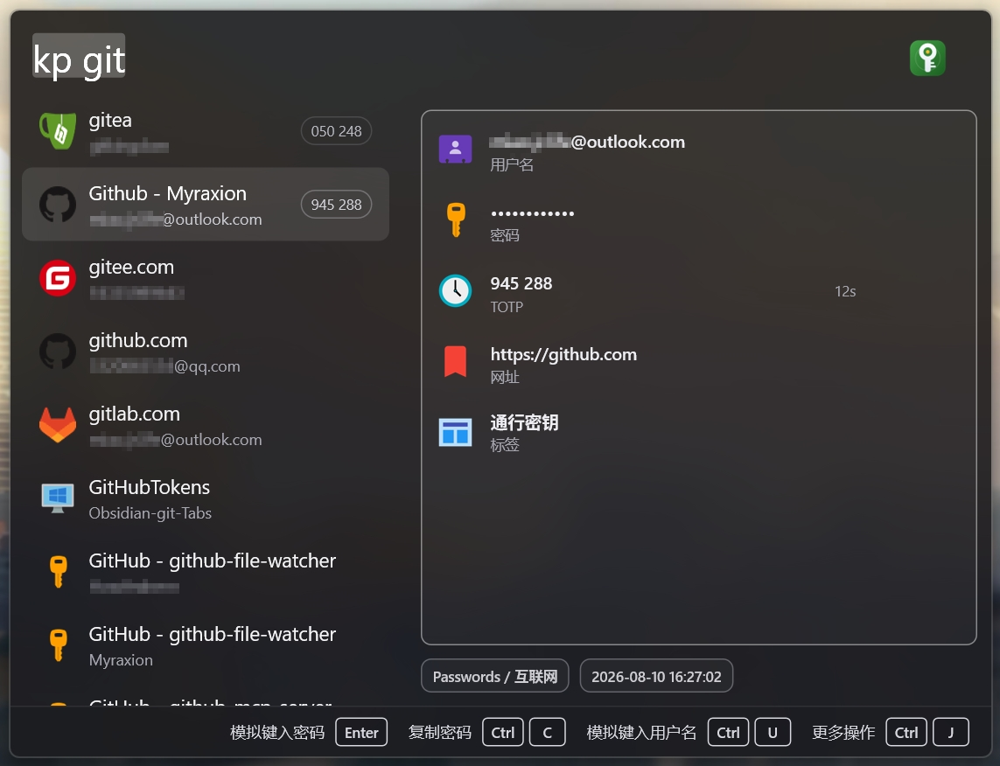

#  KeePass Wox Plugin

[](https://github.com/Wox-launcher/Wox)
[](https://github.com/Myraxion/Wox.Plugin.Keepass)
[](https://github.com/Myraxion/Wox.Plugin.Keepass)

专为 [Wox](https://github.com/Wox-launcher/Wox) 启动器打造的高效、安全、纯内存驻留的 KeePass (KDBX4) 凭据检索插件。



---

## ✨ 特性亮点

- ⚡ **快速智能搜索**：支持对标题、用户名、网址、标签及备注进行模糊与精准搜索，结合智能相关度排序，最常用的凭据一搜即出。
- 🔍 **便捷前缀筛选**：支持使用 `u:` (用户名)、`url:` (网址)、`t:` (标签)、`g:` (分组) 等前缀进行精准定位，复杂查询轻松搞定。
- 📑 **直观凭据预览**：右侧展示用户名、密码掩码、网址、TOTP、便签、修改时间等信息。
- 🎛️ **剪贴板与打字双模式**：支持一键切换“复制到剪贴板”与“模拟键盘输入”两种模式。
- 🕒 **动态验证码 (TOTP)**：支持二次验证口令及 Steam 令牌，实时倒计时刷新。
- 🔒 **安全无痕驻留**：主密码与解密数据仅保留在系统内存中，绝不写入硬盘或本地日志，锁定后不留痕迹。
- ⏱️ **自动锁定保护**：支持闲置超时自动锁定；检测到云盘（如 OneDrive、Syncthing）同步更新数据库时自动锁定，保障数据安全。
- 🚫 **灵活过滤排除**：可按标签或分组（如回收站、归档）自定义屏蔽条目，保持搜索列表清爽干净。

---

## ⚙️ 配置说明

安装完成后，请进入 **Wox 设置** -> **插件** -> **KeePass** 进行基础配置：

| 配置项                 | 说明                                                         |
| :--------------------- | :----------------------------------------------------------- |
| **KeePass 数据库路径** | 本地 `.kdbx` 数据库文件的绝对路径                            |
| **密钥文件路径**       | 可选的 `.key` 或密钥文件绝对路径                             |
| **输出模式**           | 回车及核心输出模式。可选 `clipboard`（复制到剪贴板）或 `type`（模拟按键打字，实验性：仅在 Windows 环境下完成测试） |
| **自动锁定超时 (秒)**  | 数据库空闲自动锁定的时间（秒）。默认 900 秒（15 分钟），设为 `0` 则不自动锁定 |
| **排除规则**           | 逗号分隔的排除规则，如 `g:"Recycle Bin", t:Trash`            |

---

## 🚀 使用指南

### 1. 解锁与锁定

- **解锁**：输入 `kp <主密码>` 并按 `Enter` 即可解锁（解锁后密码自动从搜索框清除）。
- **锁定**：输入 `kp lock` 即可立即手动锁定。

### 2. 检索条目

输入 `kp <关键词>` 即可模糊搜索，亦可使用前缀语法精准查找：

| 语法 | 说明 | 示例 |
| :--- | :--- | :--- |
| `kp <关键词>` | 搜索标题、用户名、网址、备注等 | `kp github` |
| `u:<用户名>` | 按用户名精准搜索（含空格用双引号） | `kp u:admin` 或 `kp u:"John Doe"` |
| `url:<网址>` | 按网址搜索 | `kp url:github.com` |
| `t:<标签>` / `g:<群组>` | 按标签或群组筛选 | `kp t:dev` 或 `kp g:Work` |

> 💡 **划词快捷搜索**：在任意软件中鼠标划选网址或域名后直接呼出 Wox，插件会自动识别网址并搜索。

### 3. 操作快捷键

可在设置中切换 **剪贴板模式**（默认）或 **模拟打字模式**：

| 操作 | 快捷键 | 说明 |
| :--- | :--- | :--- |
| **执行默认动作** | `Enter` | 剪贴板模式复制密码，打字模式自动键入密码 |
| **复制密码** | `Ctrl / Cmd + C` | 复制密码到系统剪贴板 |
| **模拟键入密码** | `Ctrl / Cmd + P` | 自动向目标窗口键入密码（防剪贴板窃听） |
| **处理用户名** | `Ctrl / Cmd + U` | 随模式自动复制或键入用户名 |
| **处理 TOTP** | `Ctrl / Cmd + T` | 随模式自动复制或键入动态验证码 |
| **打开网址** | `Ctrl / Cmd + O` | 在系统默认浏览器中打开网址 |

> 💡 选中条目按 `Ctrl + J` 可展开全部可用动作；未填写的空字段动作会自动隐藏。模拟打字功能目前在 Windows 经过完整验证，macOS/Linux 为实验性兼容。

---

## 🚫 排除规则设置

可在插件设置的 **排除规则** (`excludeRules`) 中指定需要忽略的群组或标签，多条规则使用半角逗号 `,` 分隔：

- **排除特定群组**：使用 `g:` 前缀，包含空格时用引号包裹，如 `g:"Recycle Bin"`、`g:Archive`
- **排除特定标签**：使用 `t:` 前缀，如 `t:Trash`、`t:Deprecated`

**示例配置**：

```text
g:"Recycle Bin", g:Trash, t:Hidden
```

---

## 🛠️ 本地开发与构建

### 准备环境

- Node.js (推荐 v20+)
- pnpm
- Make

### 常用命令

```bash
# 1. 安装项目依赖
make install

# 2. 运行代码检查
make lint

# 3. 运行自动化测试套件
make test

# 4. 构建插件代码 (ncc + babel 输出到 dist/)
make build

# 5. 持续监听与热编译开发
make dev

# 6. 打包为 wox.plugin.keepass.wox
make package
```

---

## 📄 License

- 插件源码采用 [MIT License](https://opensource.org/licenses/MIT) 授权 © [Myraxion](https://github.com/Myraxion/Wox.Plugin.Keepass)
- 内置数据库图标源自 [KeePassXC](https://github.com/keepassxreboot/keepassxc) 及其上游项目（遵循 MIT / CC0 1.0 协议），详情参见 [icons/database/LICENSE.md](icons/database/LICENSE.md)
